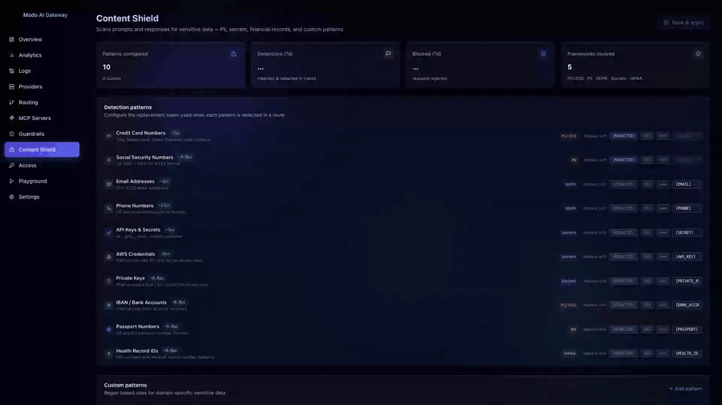

<div align="center">


# Modo AI Gateway

**The open-source AI gateway with everything you need — written in Rust.**

[](#license)
[](#)
[](https://the-modo.github.io/)

[Website](https://the-modo.github.io/) · [Download](https://the-modo.github.io/download/) · [Setup guide](SETUP.md) · [Contact](https://the-modo.github.io/#contact)

</div>

---

> ## ⚠ Non-commercial use only
>
> Modo AI Gateway is **free** for personal, evaluation, research, education and
> hobby projects — and always will be. **Any commercial use** (routing live customer
> traffic, processing paid services, internal production deployments at a for-profit
> company, hosting it as a service, embedding it in a paid product) **requires a
> separate commercial license**. Please [contact us](https://the-modo.github.io/#contact)
> *before* deploying to production.
>
> See [LICENSE](LICENSE) for the full text.

---

## What is it?

Modo AI Gateway is a single static Rust binary that sits between your applications
and every LLM provider. It speaks the OpenAI API on the inbound side and translates
to whichever upstream you've configured — OpenAI, Anthropic, Gemini, Azure, your own
mock server, anything OpenAI-compatible.

But it's much more than a translation layer. It ships with **every guardrail you
need for production AI traffic** out of the box — no plugins, no extensions, no
extra services to run.

---

## Routing — visual, drag-and-drop, live

Drag conditions, providers, content shield, guardrails and rate limits onto a
canvas. Save once, the gateway picks it up live. No YAML files, no redeploys.


The same canvas designs LLM routes and MCP-tool routes — one mental model for every
piece of AI infrastructure.


---

## Content Shield — PII never leaves your perimeter

Modo scans every prompt and response for sensitive data and redacts in flight.
Sensitive values are rewritten before reaching any upstream provider.



- 10+ built-in detectors out of the box: credit cards, SSNs, emails, phone numbers, API keys, AWS keys, IBANs, passports, health IDs, private keys
- Custom regex patterns for domain-specific data (employee IDs, internal endpoints, project codenames)
- Three actions per pattern: **redact** in-flight, **flag and log**, or **block** the request entirely
- Per-pattern processing cost measured live in microseconds — zero ML runtime, deterministic latency
- Scope each rule to prompts, responses, or both

---

## Guardrails — policy enforced before any provider sees a prompt

Block prompt-injection attempts, profanity, toxic content, sensitive topics — anything
you can describe with a keyword or regex.


- Built-in categories: prompt injection, profanity, PII, toxic content, sensitive topics
- **Flag** (audit + pass) or **block** (reject with 400) — chosen per rule and per scope
- Apply to prompts only, responses only, or both
- Every activation is recorded with the request and surfaced in the logs trace view
- Live processing cost shown in microseconds for each rule

---

## MCP Servers — one unified endpoint for every Model Context Protocol server

Register N upstream MCP servers, expose one `/mcp` endpoint to clients. Tool calls
are namespaced, logged, and guardrail-checked automatically.


- Per-tool routing, rate limits, guardrails — applied automatically
- Built-in test MCP server so you can try the flow without external dependencies
- Loop protection prevents misconfigured upstreams from causing recursion
- Tools/list aggregation across servers with `server__tool` namespacing

---

## Real-time analytics

Token counts, cost per model, cache hit rate, latency percentiles, error breakdowns.
Every chart pulls from live request logs — no test traffic noise.


---

## Audit logs with full request trace

Per-request audit: latency, cost, tokens, full request bodies, and the rules that
fired (guardrails, content shield, semantic-cache hits, MCP tool calls).


---

## At a glance

| | |
|---|---|
| **Overhead** | Sub-millisecond on commodity hardware (measured) |
| **Footprint** | Single static binary, ~12 MB. No runtime, no plugins, no daemons. |
| **Telemetry** | Zero. No phone-home, no usage tracking, no opt-out you have to find. |
| **Persistence** | Embedded SQLite by default; bring your own Postgres if you prefer |
| **Auth** | Per-key rate limits, spend caps, model and route allowlists, IP filters, TTL auto-revoke |
| **Updates** | Air-gapped via signed package upload or pull from your own update server |

---

## Quick start

```bash
git clone https://github.com/the-modo/ai-gateway
cd ai-gateway
cargo build --release
./target/release/modo-ai-gateway
```

Drop-in OpenAI replacement:

```python
client = OpenAI(base_url="http://localhost:4891/v1", api_key="sk-gw-…")
client.chat.completions.create(model="gpt-4o", messages=[...])
```

That's it for a personal install. For production-ish setups with the dashboard,
multiple providers, persistent storage, key management and HTTPS, see the
**[full setup guide → SETUP.md](SETUP.md)**.

---

## License

Modo AI Gateway is distributed under a **non-commercial source-available license**.
See [LICENSE](LICENSE) for the full text. In short:

- ✅ **Allowed** — personal use, evaluation, research, education, hobby projects, classroom use, non-profit and academic deployments, public-benefit work
- ❌ **Requires a commercial license** — routing live customer traffic, processing paid services, internal production at a for-profit company, hosting it as a service, embedding it in a paid product

**Going to production? Please [reach out](https://the-modo.github.io/#contact) first.** We'll set you up with a commercial license — pricing scales to your traffic and seat count, and includes SLAs, priority support, hardened release channel and security advisories.

---

## Get in touch

| | |
|---|---|
| Website | [https://the-modo.github.io/](https://the-modo.github.io/) |
| Download | [https://the-modo.github.io/download/](https://the-modo.github.io/download/) — email-gated, includes a copy of the license |
| Commercial inquiry | [https://the-modo.github.io/#contact](https://the-modo.github.io/#contact) |

---

<div align="center">

© Modo AI Gateway. All rights reserved. Free for non-commercial use.

</div>
